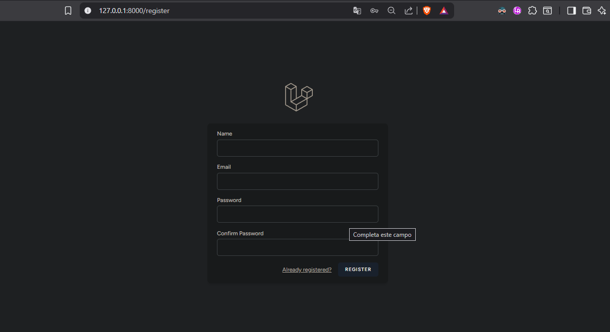
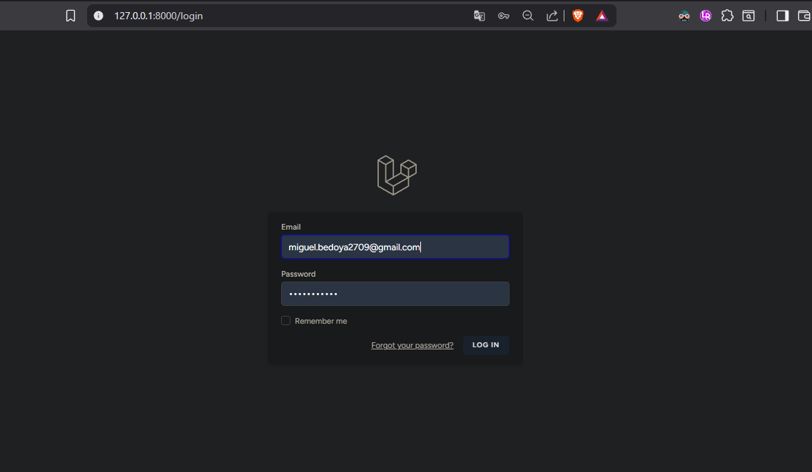
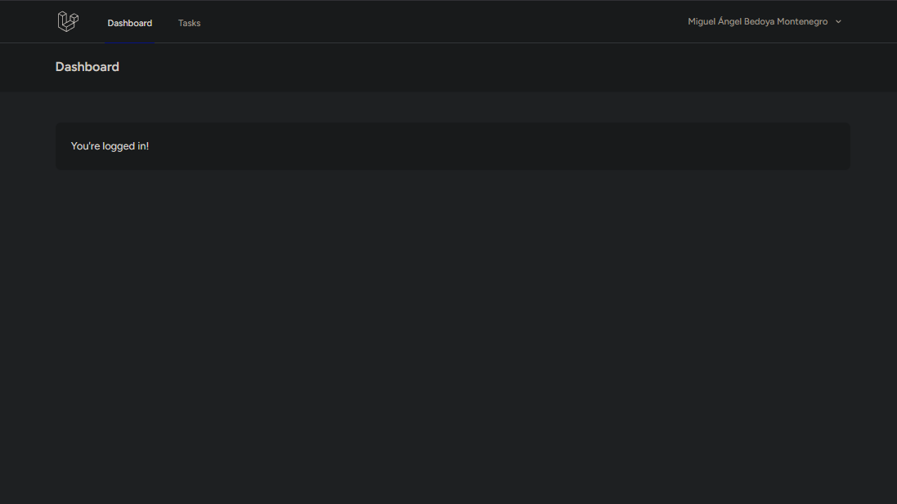
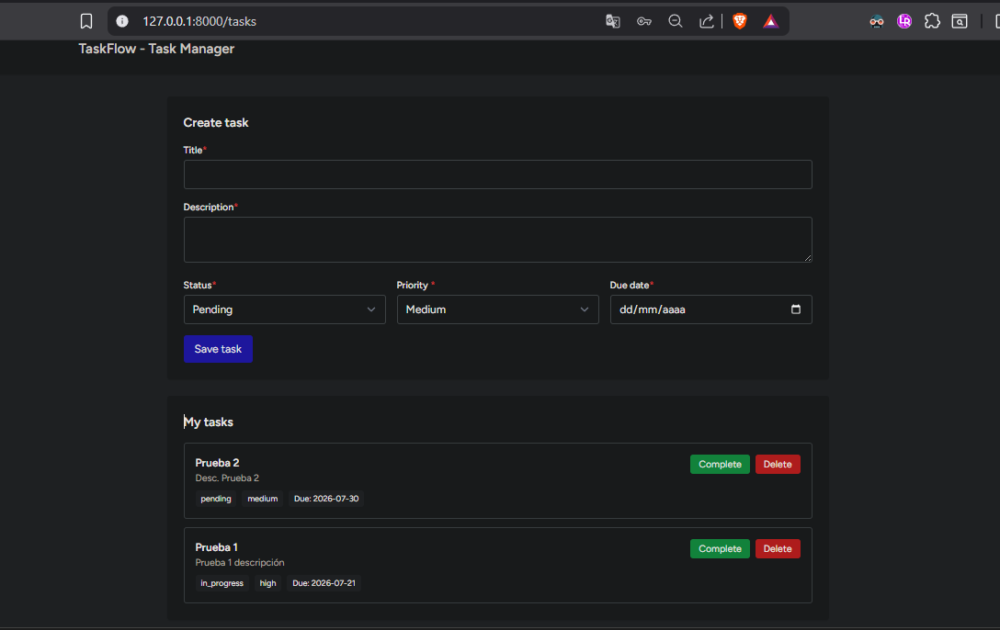
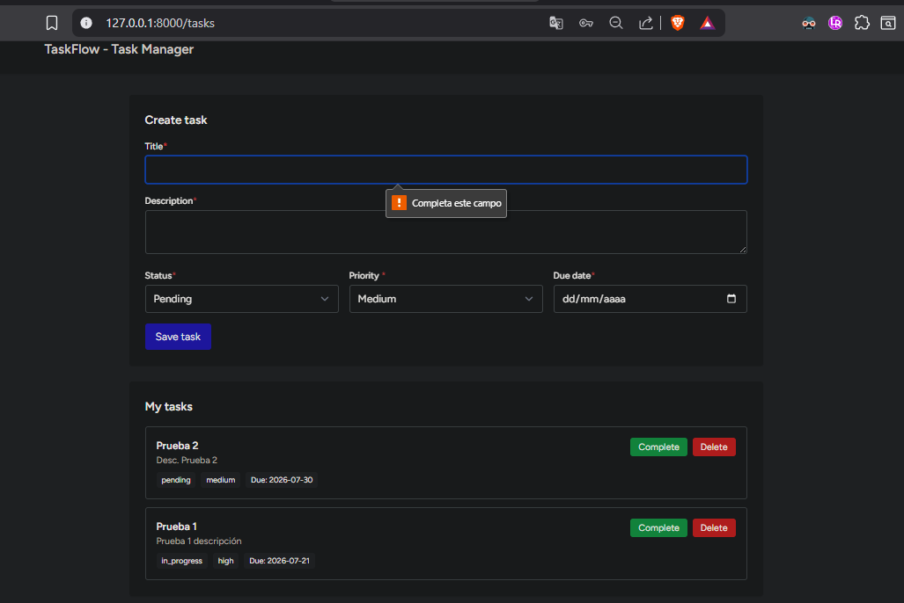

# TaskFlow - Laravel Vue Task Manager

TaskFlow is a simple task management web application built with Laravel, Vue, Inertia.js, Tailwind CSS and SQLite.

This project was created as a practical portfolio project to demonstrate adaptability to the Laravel + Vue ecosystem, applying backend development fundamentals such as authentication, routing, database modeling, validation and CRUD operations.

## Tech Stack

- PHP
- Laravel
- Vue
- Inertia.js
- Tailwind CSS
- SQLite
- Vite

## Main Features

- User registration and login
- Authenticated dashboard
- Protected task management page
- Create tasks
- List authenticated user's tasks
- Mark tasks as completed
- Delete tasks
- Task status management
- Task priority management
- Required due date field
- Server-side validation
- Basic user ownership validation

## Screenshots

### Register



### Login



### Dashboard



### Tasks



### Validation Error



## Project Purpose

The purpose of this project is to demonstrate a first functional implementation using Laravel and Vue, aligned with backend and full-stack job requirements.

My main experience is focused on Java, Python and databases, but this project was developed to demonstrate fast adaptation to the Laravel + Vue stack while applying previous software development fundamentals.

## Functional Flow

1. A user registers or logs in.
2. The authenticated user accesses the dashboard.
3. The user opens the task management page.
4. The user creates a task with title, description, status, priority and due date.
5. The user can mark a task as completed.
6. The user can delete a task.
7. Each user can only see their own tasks.

## Local Setup

### 1. Clone the repository

```bash
git clone https://github.com/Mikel2709/taskflow-laravel-vue.git
cd taskflow-laravel-vue
```

### 2. Install PHP dependencies

```bash
composer install
```

### 3. Install JavaScript dependencies

```bash
npm install
```

### 4. Create environment file

```bash
cp .env.example .env
```

On Windows, if `cp` does not work, use:

```bash
copy .env.example .env
```

### 5. Generate application key

```bash
php artisan key:generate
```

### 6. Configure SQLite database

Make sure the `.env` file uses SQLite:

```env
DB_CONNECTION=sqlite
```

Create the SQLite database file:

```bash
type nul > database\database.sqlite
```

### 7. Run migrations

```bash
php artisan migrate
```

### 8. Start Vite development server

```bash
npm run dev
```

### 9. Start Laravel development server

In another terminal:

```bash
php artisan serve
```

Open the app at:

```txt
http://127.0.0.1:8000
```

## Manual QA Checklist

The following validations were performed:

- User can register successfully.
- User can log in successfully.
- User can log out successfully.
- Guest users cannot access `/tasks`.
- Authenticated users can access `/tasks`.
- User can create a task with required fields.
- Title is required.
- Due date is required.
- Status and priority are stored correctly.
- User can mark a task as completed.
- User can delete a task.
- Tasks persist after page reload.
- One user cannot see another user's tasks.

## Main Routes

| Method | Route | Description |
|---|---|---|
| GET | `/register` | User registration page |
| GET | `/login` | User login page |
| GET | `/dashboard` | Authenticated dashboard |
| GET | `/tasks` | List authenticated user's tasks |
| POST | `/tasks` | Create a new task |
| PATCH/PUT | `/tasks/{task}` | Update a task |
| DELETE | `/tasks/{task}` | Delete a task |

## Project Status

Functional MVP completed.

Planned improvements:

- Add task editing form.
- Add filters by status and priority.
- Add automated feature tests.
- Add deployment.
- Improve UI design and responsive behavior.
- Add confirmation modal before deleting tasks.

## Author

Miguel Ángel Bedoya Montenegro  
Backend Developer with experience in Java, Python, SQL and software development fundamentals.

GitHub: [Mikel2709](https://github.com/Mikel2709)  
LinkedIn: [miguel-bedoya-m](https://linkedin.com/in/miguel-bedoya-m)